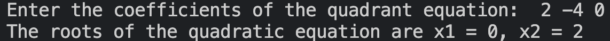

# О ПРОЕКТЕ

В этом проекте была написана программа, которая решает квадратные уранения. У нее есть два режима: **Release** и **Debug**.

Для сборки **Release** в терминале напишите ``make release``.

Для сборки **Debug** - ``make debug``. В данном режиме отработано использование **Unit** тестов.

